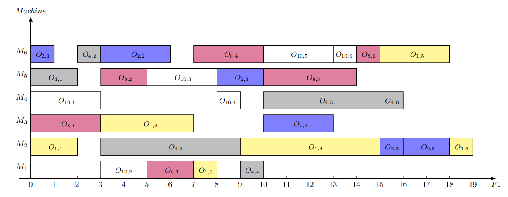

基于Latex中tikz实现绘制分布式柔性车间调度问题甘特图

**使用方法**

在matlab中运行下面代码得到latex编码保存到sp路径下

将sp对应的文本文档中的内容复制到```gantt.tex```文件中，即可得到甘特图

优势在于：得到的甘特图直接为单页pdf格式，无需裁剪与分离，可以直接插入

```
% 行向量x
x = [2	2	1	2	1	1	1	2	1	2	2	3	1	2	6	2	6	6	5	3 ... ];
% 数据集路径p, 机器个数2, 结果保存路径sp
sp = "";
bkg = readdata(p, 2);
% 修改x2Gantt.m的第2行sp的值
x2Gantt(x, bkg, sp);
```

**一些文献**

解向量的编码方式：Meng L, Ren Y, Zhang B, et al. MILP modeling and optimization of energy-efficient distributed flexible job shop scheduling problem[J]. IEEE Access, 2020, 8: 191191-191203.

数据集Mk：Brandimarte P. Routing and scheduling in a flexible job shop by tabu search[J]. Annals of Operations research, 1993, 41(3): 157-183.

数据集DP：Dauzère-Pérès S, Paulli J. An integrated approach for modeling and solving the general multiprocessor job-shop scheduling problem using tabu search[J]. Annals of Operations Research, 1997, 70(0): 281-306.

**实现效果**



**其他想法**

对于其他数据格式和编码方式，其实只需要简单修改代码都可以自动生成甘特图
